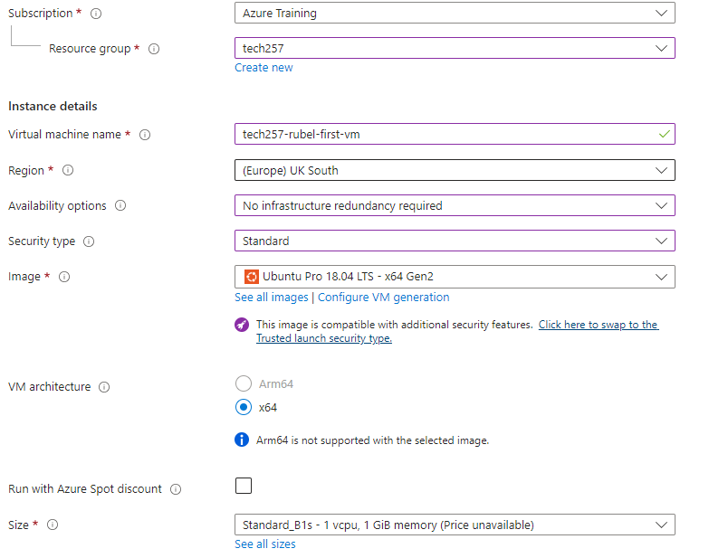
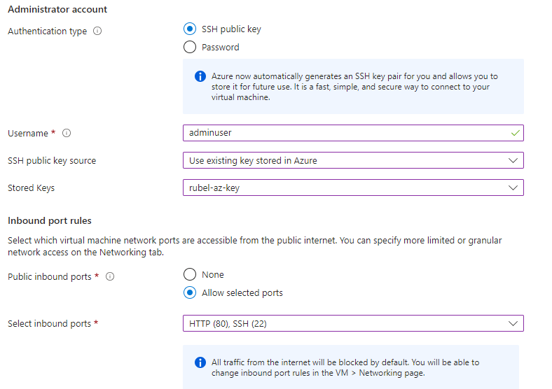
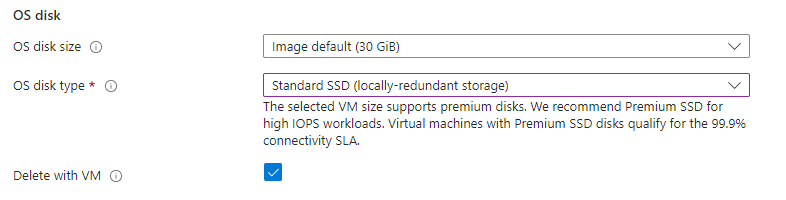
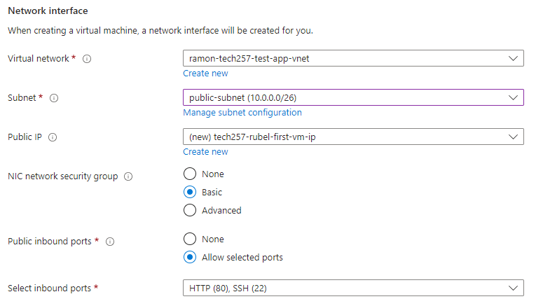
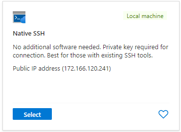
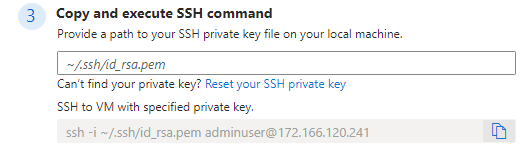
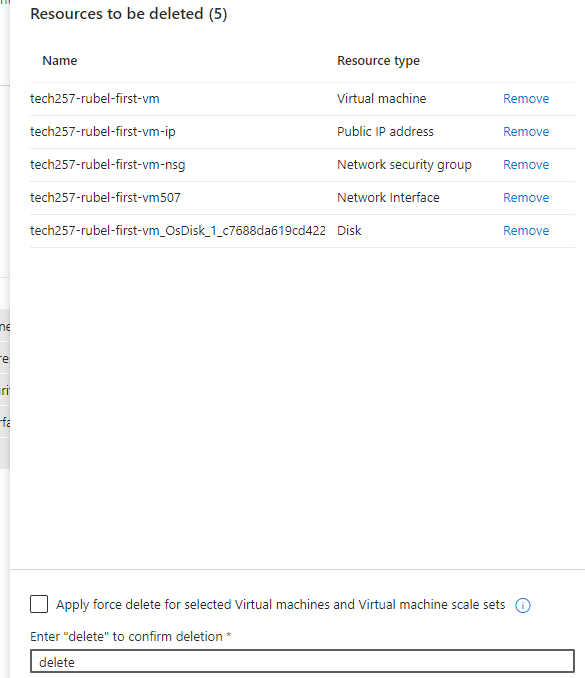
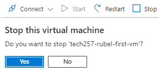

# Virtual Machine
**'A Computer inside a Computer**
- Virtualized server that doesn't need a physical presence
- Acts as a complete comp system with its own CPU, memory, storage, OS.
- Independent and does not need other VMs

## How to Create A VM

### 1. Creating SSH key
Why do we need it?
- SSH key will be what we use to login into the VM
1. Go to ssh folder on gitbash
2. ssh-keygen -t rsa -b 4096 -C "<email>"
   - creates key pair
3. Name it appropriately
4. cat <public key>
   - shows public key to copy when needed to put on the portal

### 2. Creating the VM
1. Go to Virtual Machines
2. `Create`: on the drop-down click the first one
   - Gives azure vm without default settings
3. **Basics:**
   1. `Subscription` - Azure Training
   2.  `Resource Group` - tech257
   3. `Virtual Machine Name` - tech257-rubel-first-vm = naming convention
   4. `Region` - (Europe) UK South - Leave as this
   5. `Availability Zones` - Change to 'No infrastructure redundancy required'
   6. `Security` - Standard
   7. `Image` - Ubuntu Pro 18.04 LTS - x64 Gen2
      - Image is the operating system being used and is provided by different companies
      - Ubuntu is free one and 18.04 usually needed to be found through 'See all images'
   8. `Size` - Standard B1s 
      - only allows 1vcpu and 1 Gib memory (what we need)

   9. `Authentication` - 
      - Username = what name will be used to logon to VM (adminuser)
      - `SSH public key source` - existing in Azure
      - `Stored Keys` - priv key that was created
   10. `Port Rules` - SSH is enough but add HTTP aswell

4. **Disks**
    1. `OS disk type` - we want changed to standard SSD

5. **Networking**
    1. `VNet` - VNet used will either be one you created but for now the default one present
   2. `Subnet` - Public
   3. Also select to delete Public iP and NIC when VM is deleted

6. **Skip to Tags** - (as the other ones are not needed now)
   - Owner:Name

### 3. Connecting to VM 
1. `Connect` button: should take you to two recommended SSH options
   - Select Native SSH 

2. Option 3: Using priv key to login
   - ~/.ssh/<keyname>

   - after entering it will give you a command to use, Copy it
3. Enter the copied command into gitbash and enter
4. Will not recognise as it is the first time it has been created so type yes
  

6. Successfully logged in

### 4. Deleting VM
1. Go to Resource Groups
2. filter your name and select all VM related things except the SSH key
3. Select

