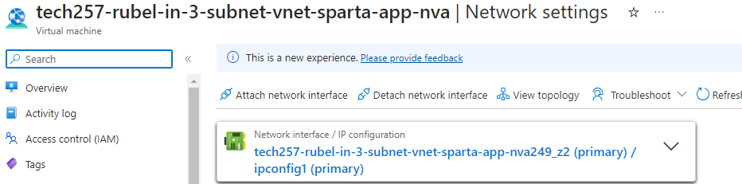

# 3-Subnet Architecture

A 3 Subnet architecture comprises of an App Subnet, Database subnet but also a Networking Virtual Appliance (NVA) subnet which is responsible for allowing traffic communcation between both the App and Database. This type of architecture increases the security tenfold but having a lot more restrictions and control over what travels and what is restricted. 


# Steps to creating 3-subnet architecture
## 1. Create the Virtual Network
1. `Name` the VNet
2. Add subnets with IP addresses:
   - public subnet - 10.0.2.0/24
   - dmz subnet (subnet for NVA) - 10.0.3.0/24
   - private subnet - 10.0.4.0/24, 
     - You want to enable 'private subnet', this will allow it to have no default outbound access like MongoDB so will need to config in the APP user data script
  

## 2. Create Database VM
**Why? To get the private IP address so we can use it to add to the APP VMs user data script to install mongoDB
1. Name with detail that it will be part of the 3-subnet vnet
2. Put it in Zone 3 AZ
3. Choose appropriate `Image` 
4. Autenticate with existing SSH key
5. Only need SSH port 
6. Put in the VNet that was just created for use (3-subnet-vnet) and choose the subnet as the private subnet
7. We dont want it to have a public IP address to restrict access from public so select `None`
   
8. `Advanced` - in the user data, enter the bash script lines that update and upgrade in the VM as this will reduce time when in the VM

## 3. Create App VM
1. Name with detail that it will be part of the 3-subnet vnet
2. Put it in Zone 1 AZ
3. Choose Image for the app that has all dependencies installed on it
4. Open SSH and HTTP ports
5. Configure Network Interface settings with subnet as the public subnet
   
6. `Advanced` - User Data:
```
#!/bin/bash

export DB_HOST=mongodb://10.0.4.4:27017/posts

cd /tech257_sparta_app/app

pm2 stop app.js

pm2 start app.js
```
- This extra line exports the enviroment variable that establishes and recognises the connection of the database to the app 

## 4. Create NVA VM
1. Name with detail that it will be part of the 3-subnet vnet
2. Put it in Zone 2 AZ
3. Choose appropriate `Image`
4. Only need SSH port opened
5. Configure NI settings and place this VM in the dmz-subnet
   

## 5. Testing whether the App can communicate with the Database
1. SSH into the app VM
2. `ping <database ip>`
   
   After pinging, if it keeps going then it means traffic is being sent and communication is LIVE!
3. `ANOTHER METHOD` - Check whether the posts page works 

## 6. Create and configure Route table
1. Name and create

2. Add a route
   
3. Associate a subnet to the Route table (where the information will be sent from)
   
   If you check whether the posts page is working or if any more pings are happening, it would show that its not working.
   - This is because the Route table has been setup so it received traffic to send from the public subnet but arrives at the dmz subnet and doesnt know what to do next, so IP forwarding needs to be configured
  
## 7. Ip forwarding Azure and VM
1. Azure 
   1. Go to the NInterface of the NVA VM and click on the link with IP Configurations

   2. Enable IP forwarding
   
1. VM 
   1. SSH into NVA Vm
   2. `sysctl net.ipv4.ip_forward` = Command to check whether IP forwarding is enabled but will come up with =0, need to change conf file
   3. `sudo nano /etc/sysctl.conf` - Uncomment which conf is needed to be enabled so uncomment `net.ipv4.ip_forward=1`
   4. `sudo sysctl -p` - reload and it should become enabled
   5. Checking your pings, it should be working again

## 8. Configure IPTables 
At this point, communication is working and the NVA is directing the traffic from public to private subnet but without IPTables, everything is being sent. We need more control so in a IPTable, we insert what we want to be sent.
1. Create a config file named `config-ip-table.sh` and input ip tables
2. Save, change permissions and execute the file
3. Now whichever rules you have inserted will be the traffic being forwarded
