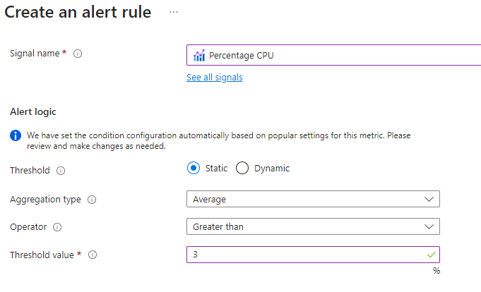

# Azure Monitor and Monitoring

1. This VM with a lot of usage and high demand specifically a high CPU load will eventually fall over with no monitoring involved
2. This VM has Azure Mointoring at the lowest level which is the use of a dashboard checking different metrics however someone will need to be watching this at all times which will lead to eventually missing something.
3. This VM has Azure Monitor but also uses an alarm which sends a notification to the correct team whenever something spikes. This can be good but not always effective as the team will need to be ready to be available at all times.
4. This VM uses Azure Monitor with auto-scaling. This is where the VM is scaling depending on the demand, create more when high and delete when low. 

## Setting up Dashboard
1. Go to the VM, in the overview there is a Monitoring section which has metric charts
2. Click the pin button which will tell you to send to existing dashboard or a new one. 
   
3. We want to create a shared dashboard within the resource group being used

4. Go to DashboardHub to view the dashboards, you can edit how you ant each chart to be, can also change the `time range` 

## How the dashboard helps us
Viewing the metrics, for example the CPU metric, whenever there is a high usage of CPU, the graph will show spikes with percentages showing how much as used. This can help in the long run to eventually set up alerts if usage ever goes above a set threshhold

## Load Testing and how dashboard and Load Testing can be used as a combination

With the dashboard metrics set with CPU as one metric being measured, we can test different loads using apache
1. `ab -n 1000 -c 100 http://<app VM's IP address>/`
   - Sends 1000 requests and after a while, the metrics should show a change
  

1. `ab -n 10000 -c 200 http://<app VM's IP address>/`
- From this it timed out at 2349 requests as it couldnt handle it.

