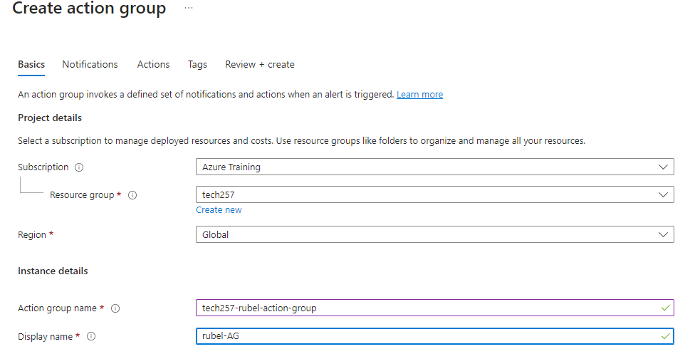
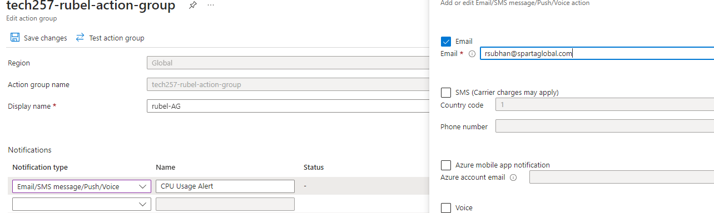
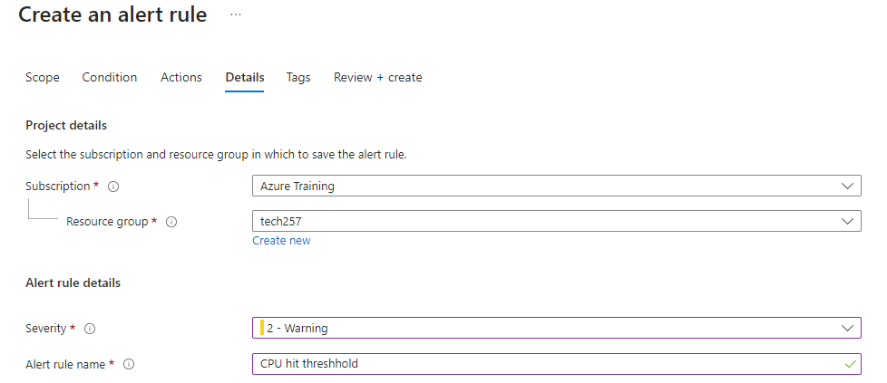
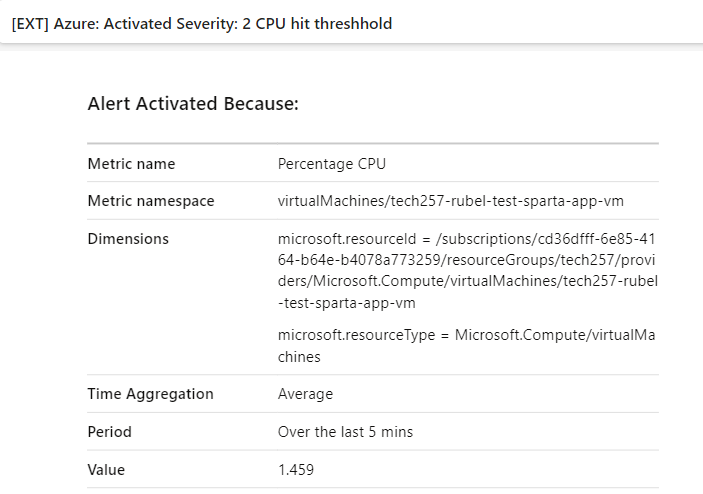

# Alerts

1. Go to create Alert rule

2. Set up the threshhold, for this I chose 3% as when I was load testing, my average was 3%
3. Create an action group 

This is the type of Notification that is chosen and I chose email so it will send me the alert via email

4. On the Detials section, give the alert a name and severity of the alert.

5. After 5minutes, an alert was sent to my email as it went higher than the threshhold
 
