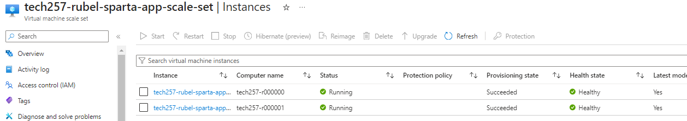

# VM Scale Sets

## What is it
- A scale set is a feature that allows auto creation/deletion of VMs depending on demand.
- Needs: 
  - Load Balancer - redirects the traffic, all access will be through here using its public Ip
  - Scaling count config - You set the number of VMs, the threshold of when it needs to either scale up/down
  - Public Subnet where the VM instances reside in

## Create Scale Set
### Basics
1. Go to VM scale sets
2. `Create`
3. Name
4. Select number of Availability Zones (we want 3)
   
5. For Orchestration mode, select `Uniform` - this will give identical VMs
6. `Scaling` - Choose Autoscaling which will give section to configure how we want to scale
   
7. `image` - The image we use will be what gives app dependencies - choose the image you created
8. `Size` - Standard B1s
9.  Setup SSH key

### Disks
1. Standard SSD

### Networking
1. Sect `VNet` - use one that is the same as the one being used for the app
2. `Load balancer`:
   - Create New if not existing
   - Give a name
   - Leave rest of the config same (the HTTP Port will be 80 for front/backend - this is how it enters through http), (SSH Port uses port 50000 a frontend to get in but accesses the back end via port 22 which is how the VMs are accessed)

### Health
1. Enable health monitoring

### Advanced
1. Enter your user data script

### Tags
Give the standard Owner and name tag

## Created Scale Set
Once created, you can view what you are provisioning using the load balancer public Ip, this is because the load balancer is what redirects the traffic to each VM when needed. This Ip is also the Ip of the scale set

1. Instances:
   
- The vms created will show its status, if one is unhealthy for the specified time, it will be deleted and the scale set will create a new VM according to how many you limited to
- 