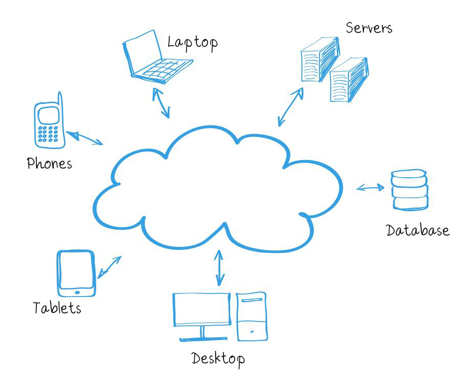
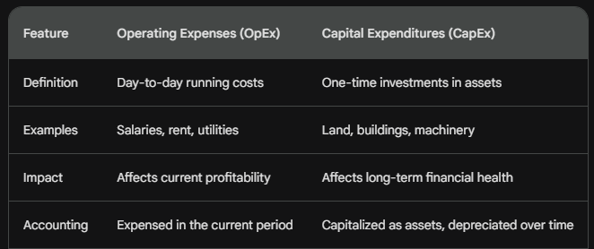
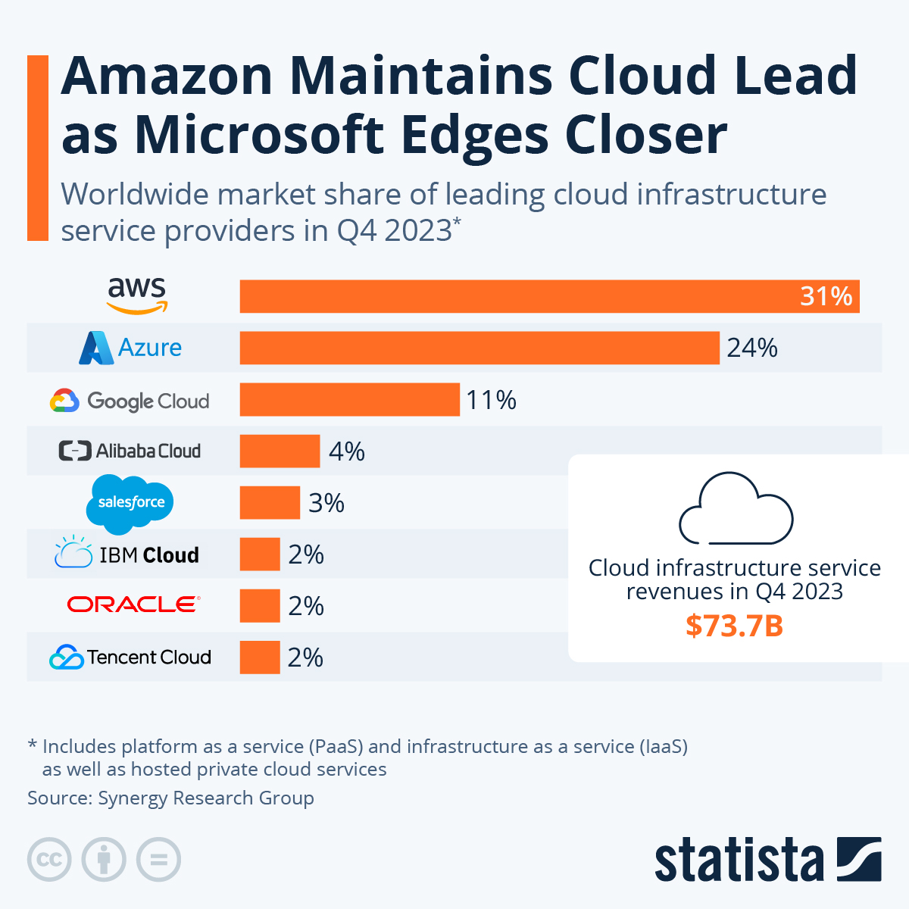

# What is Cloud Computing
### *'Without the need for physical infrastructure'*

####   Cloud Computing is a way to help businesses/ individuals reduce physical hardware by using services that are not theirs
- Resources that are used through the internet without the need to own any of it
- the hardware does not need to managed by the business, so you have a big pool of resources without using your own electricity of hardware
- Diagram:
  - Every hardware device can be used through the cloud

### Quick History
- 

### What can you do with Cloud Computing
1. **Data storage and Management**
   - File storage and sharing
   - Data backup and archiving
   - e.g: if you lose your iphone, you can use the cloud to restore everything on there
2. **Software and Apps**
   - can run cloud based software (SaaS)
   - Developing/Deploying apps
     - AWS/Azure; tools to build apps
3. **Computing Power and Resources**:
   - Scalability/Elasticity
   - High performance computing
4. Collab/Comms

### 4 TYPES OF CLOUD
1. **PUBLIC**
   - Resources are offered over the internet by cloud providers
     - PROS: Cost-effective, scalable, readily available
     - CONS: Lack of security and control
2. **PRIVATE**
   - Dedicated cloud env for single-org eg hosted premise or third party provider
     - PROS: Greater control, security, customisation 
     - CONS: Higher costs and need to manage the infrastructure
3. **HYBRID**
   - Combined pub and priv
   - Leverage both flexibility and cost-eff of public but security of private with sensitive data
   - Migrating takes time so keeping a hybrid approach help to slowly migrate the process
4. **MULTI-CLOUD**
   - Using multiple public clouds from different providers simultaneously
   - Reduce redundancy and improves fault tolerance but managing multiple can become difficult

### SERVICE MODEL
1. **Infrastructure as a Service (IaaS)**: IaaS lets users install their own operating systems and apps by providing the servers, storage, and networking that make up the core infrastructure. In essence, they rent the hardware and handle the software.
2. **Platform as a Service (PaaS)**: PaaS provides an application development, deployment, and management platform. In addition to extra tools and services like databases, development tools, and middleware, it also comprises the infrastructure (such as IaaS).
3. **Software as a Service (SaaS)**: SaaS offers fully functional online applications. Users just subscribe to and utilise the product directly; they are not involved in managing any platform or infrastructure components

### ADVANTAGES
1. Cost-effective (PAYG)
2. Scalability: change in demand 
3. Increased Accesibility: can be accessed anywhere with internet
4. Improved Collab
5. Disaster Recovery: backups and DR solutions

### DISADVANTAGES
1. Security
2. Internet dependency 
3. Limited control

### OpEx
- The ongoing costs to run the business on a day2day basis
  - keeping revenue and operational eg rent

### CapEx
- Large one time expenses with getting or upgrading physical assets eg building

### Marketshare

### 3 largest Cloud Providers
1. **AWS**
   - Market leader
     - offers most amount of services
     - storage, compute, databases
   - Global infrastructure 
     - data centers globally across different regions and availability zones
2. **Azure**
   - Microsoft products
     - Azure integrates with a bunch of Microsoft products
       - Active Directory
   - Hybrid Cloud Capabilities
3. **GCP**

### 4 Pillars of DevOps
1. **Culture and Collab**
   - breaking the obstalcles between different teams with cross-functional teamwork a big highlight
   - open comms and goals
   - Cloud provides tools to communicate better
2. **Automation**
   - automating repetitive tasks
   - reduces manual error, improves effieciency
   - Cloud: various tools and APIs to help automate 
3. **CI/CD**
   - frequent code change and deployment
   - faster feedback and better products
4. **Monitoring and Feedback**
   - Continuously monitoring so issues are always prioritised

### 3 Case Studies of Businesses using Cloud
1. **DropBox**
   - **Why?**: They were struggling to keep on pace with demand with their in premise infrastructure
   - **Solution**: Mirated to AWS in 2010 giving them scalable storage and more processing power
2. **Netflix**
   - **Why?**: Initially relied on Content delivery networks and pyhsical servers - not good for Netflixs demands
   - **Solution**: Migrated entire infrastructure to AWS, 2012. 
     - Increased scalability to reach more global audience

### How does Cloud Computing work as a business model?
**As it is dependent on demand and what you need, Cloud adops the PAYG model**

### What sorts of things do you usually need to pay for when using the cloud?
1. Compute resources:
   - Processing Power - amount of computing power eg CPU
   - Memory - amount of RAM 
   - Storage - where to store data
2. Networking:
   - Data transfer - amount of data that goes in and out of the cloud
3. Other:
   - Software licenses 
   - Support
   - Service model
   - Region
   - 